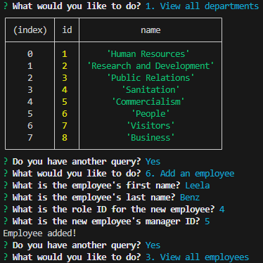

# Database Viewer

A simple utility for creating and seeding an example database, then using the terminal to view and edit data.

## Installation
After downloading the application, run "npm i" to install the necessary packages for reading input and information from the databases.

Utilize the MySQL shell to run the 'schema.sql' and 'seeds.sql' files to populate the example database.

Before usage, ensure that the 'password' property of the connection variable in index.js is set to your correct database password, otherwise the connection will fail.

## Usage
[Example video](./assets/bootcamp-sql-example.webm)

Run 'node index.js' in the terminal to activate the utility and be presented with a list of options. Use the arrow keys and Enter button to navigate. When prompted to input data, enter information congruent with data already existing in the chosen table.

## Credits
N/A

## License
Please refer to the LICENSE in the repo.